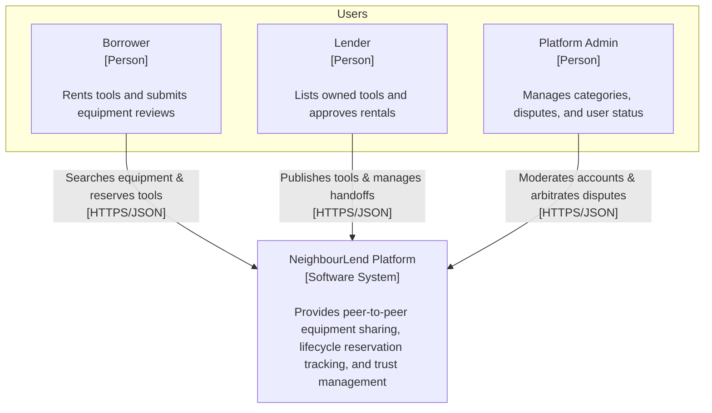
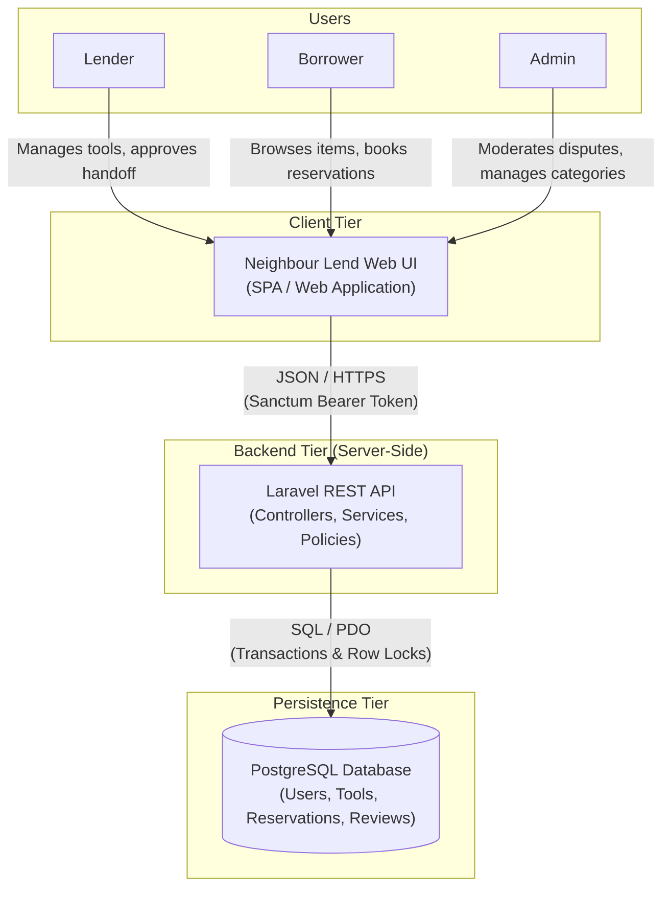
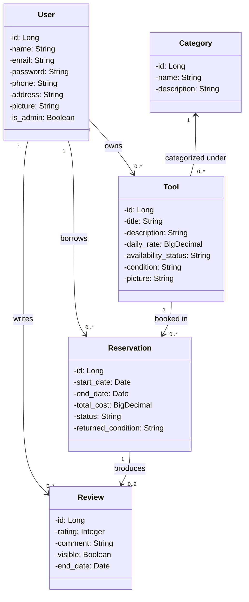
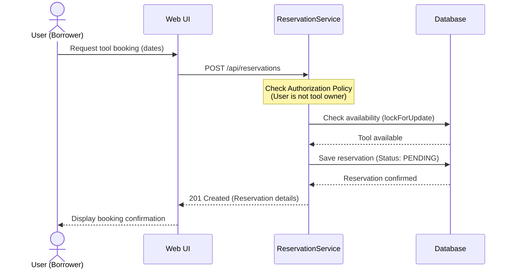

# NeighbourLend: Community Equipment & Tool Sharing Hub

<!-- CI badge: after Session 4, replace ORG/REPO and the workflow filename, then uncomment:

-->

**Student:** Leduan Flores · **Course:** CEN 5064 Software Design, Fall 2026 · **Partner:** Dioni Dinza

## Project

NeighbourLend is a monolithic, three-tier web application designed to facilitate peer-to-peer lending of tools, outdoor equipment, and household appliances within a local community or campus. The platform serves community members and students who need temporary access to specialized equipment without purchasing it. Built over a single relational database with strict domain-layer business logic, its four core features include:

Catalog & Availability Filtering: Item discovery with dynamic availability verification based on reserved date ranges.

Reservation State Engine: An end-to-end booking workflow enforcing valid state transitions (Requested → Approved → Active → Returned → Inspected/Completed).

Double-Booking & Conflict Validation: Strict domain logic preventing overlapping active reservations for the same physical asset.

Dual-Sided Trust & Return Review System: Post-loan condition confirmation, dispute flagging, and peer reputation scoring.

## How to run

```
[Exact commands to build and run your system from a clean clone.
Update this every time the steps change — your partner and your
instructor will follow it literally on conference days.]
```

## Architecture

### Tier breakdown (Session 2 studio)

| Tier | Responsibilities in THIS system | Example Classes/Modules |
|------|--------------------------------|--------------------------|
| Presentation | Captures user input, handles session state, triggers form validation, and renders views or serializes JSON. | Authentication; UserDashboard**; ToolManagement; ToolCatalog; ToolRequest; ToolReturn; UserProfile**; UserReview**; |
| Service | Coordinates application workflows, authorization checks, and transaction boundaries. | ToolService; UserService; AuthService; ReservationService; ReviewService |
| Domain | Contains core business logic, invariant enforcement, and state transitions independent of the database or UI. | Tool; User; Reservation; Review |
| Data | Manages all direct queries, database migrations, model relationships, and transactional queries. | ToolStore; UserStore; ReservationStore; ReviewStore |

 **(Lender && Borrower)

### Tech Stack
- Frontend: Vue.js 3 (Composition API) for a lightweight, responsive, and component-driven user interface.
- Backend: PHP (Laravel) structured around a strict N-tier architecture (Presentation, Service, Domain, Data) to isolate business logic and routing.
- Database & ORM: A single relational database (MySQL/PostgreSQL) managed via Eloquent ORM to handle transactional safety, data constraints, and optimistic/pessimistic locking.

### C4 — Context & Container (Session 3 studio)









## Architecture Decision Records

Decisions live in [`docs/adr/`](docs/adr/). Start with ADR-001 in Session 4.

| # | Decision | Status |
|---|----------|--------|
| [001](docs/adr/adr-001.md) | [What I am building and why] | [proposed] |

## Weekly log (optional but recommended)

A one-line note per week keeps your commit story readable:

- Week 3 (Sep 21): creating new issue, setting up a branch
