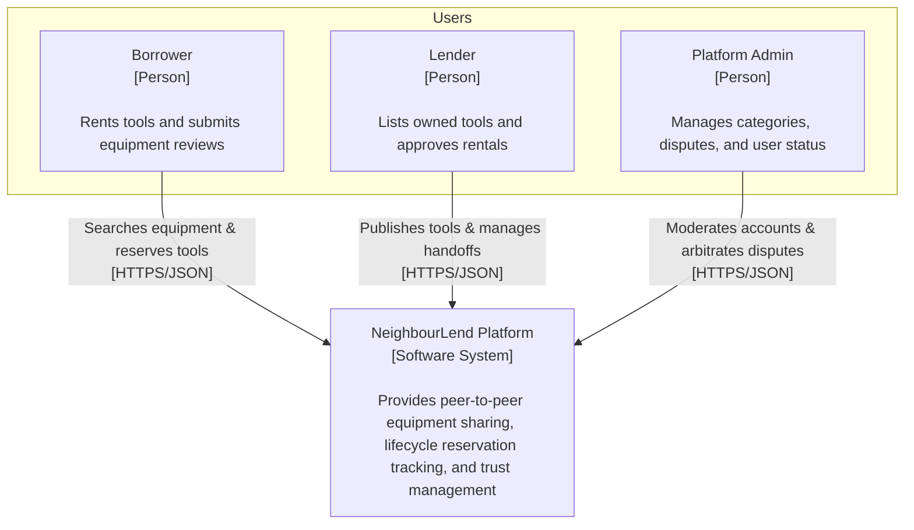
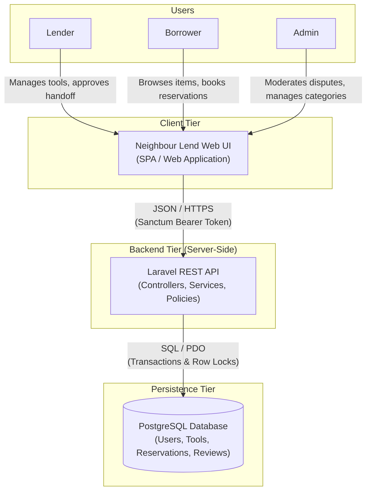
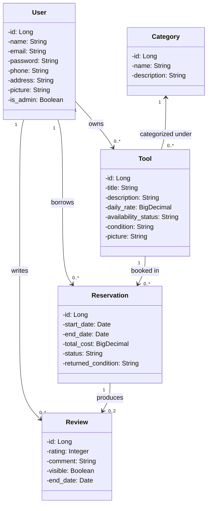
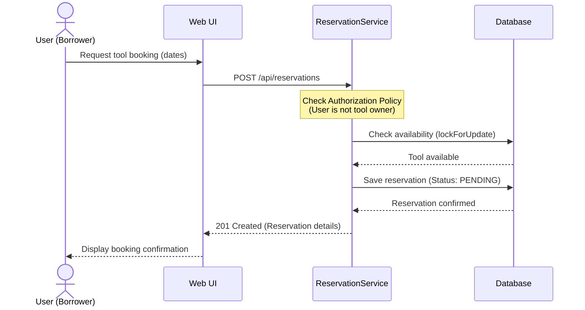

# NeighbourLend: Community Equipment & Tool Sharing Hub

<!-- CI badge: after Session 4, replace ORG/REPO and the workflow filename, then uncomment:

-->

**Student:** Leduan Flores · **Course:** CEN 5064 Software Design, Fall 2026 · **Partner:** Dioni Dinza

## Project

NeighbourLend is a monolithic, three-tier web application designed to facilitate peer-to-peer lending of tools, outdoor equipment, and household appliances within a local community or campus. The platform serves community members and students who need temporary access to specialized equipment without purchasing it. Built over a single relational database with strict domain-layer business logic, its four core features include:

Catalog & Availability Filtering: Item discovery with dynamic availability verification based on reserved date ranges.

Reservation State Engine: An end-to-end booking workflow enforcing valid state transitions (Requested → Approved → Active → Returned → Inspected/Completed).

Double-Booking & Conflict Validation: Strict domain logic preventing overlapping active reservations for the same physical asset.

Dual-Sided Trust & Return Review System: Post-loan condition confirmation, dispute flagging, and peer reputation scoring.

## How to run

### Prerequisites

Install the following tools before starting:

- Git
- PHP and Composer (use the PHP version required by `neighbourlend/composer.json`)
- PostgreSQL and the PHP PostgreSQL extensions (`pdo_pgsql`, `pgsql`)
- Node.js and npm (use the Node.js version supported by the Nuxt project)

Verify the installed tools with `php -v`, `composer --version`, `php -m`, `node -v`, and `npm -v`.

### 1. Clone the repository

```bash
git clone https://github.com/friera92/cen5064-project-flores.git
cd cen5064-project-flores
```

All paths below are relative to the repository root.

### 2. Set up PostgreSQL

Start PostgreSQL and create a local database named `neighbourlend`. Create or use a PostgreSQL account with permission to access that database. Keep database credentials in the backend `.env` file; do not commit them to Git.

### 3. Configure and start the Laravel API

Open a terminal in the repository root:

```bash
cd neighbourlend
composer install
```

Copy the environment template:

```powershell
# PowerShell (Windows)
Copy-Item .env.example .env
```

On macOS/Linux, use `cp .env.example .env` instead. Edit `neighbourlend/.env` to match your local PostgreSQL setup and the frontend URL:

```dotenv
APP_URL=http://localhost:8000
DB_CONNECTION=pgsql
DB_HOST=127.0.0.1
DB_PORT=5432
DB_DATABASE=neighbourlend
DB_USERNAME=your_postgres_user
DB_PASSWORD=your_postgres_password
SANCTUM_STATEFUL_DOMAINS=localhost:3000
```

If the project uses `config/cors.php`, allow the Nuxt origin `http://localhost:3000` in `allowed_origins`, include `api/*` in `paths`, and allow the required request methods and headers. For the current Bearer-token authentication flow, browser cookies are not required. If `config/cors.php` is absent, it can be published with `php artisan config:publish cors`.

Initialize the Laravel application and database:

```bash
php artisan key:generate
php artisan migrate
php artisan config:clear
```

If the repository provides seeders and demo data is needed, run `php artisan db:seed` (check available seeders first).

Start the backend:

```bash
php artisan serve --host=localhost --port=8000
```

The API will be available at `http://localhost:8000`. Keep this terminal running.

### 4. Configure and start the Nuxt frontend

Open a **second terminal** at the repository root:

```bash
cd ui
npm install
```

Create `ui/.env` with:

```dotenv
NUXT_PUBLIC_API_BASE=http://localhost:8000
```

Ensure `ui/nuxt.config.ts` exposes `runtimeConfig.public.apiBase` so the frontend can read `NUXT_PUBLIC_API_BASE`.

Start the frontend:

```bash
npm run dev
```

Open `http://localhost:3000` in your browser. Keep both the Laravel and Nuxt terminals running.

### 5. Verify the local setup

- Confirm that the Nuxt homepage loads at `http://localhost:3000`.
- Confirm that Laravel responds at `http://localhost:8000/up`.
- Use a valid account to sign in via `POST /api/login`. The API returns a Sanctum token, which authenticated requests send as `Authorization: Bearer <token>`.
- Test the reservation quote endpoint after signing in. A `401 Unauthenticated` response usually means the Bearer token was not sent or is invalid.

**Troubleshooting:** If Laravel reports `could not find driver` for `pgsql`, enable the `pdo_pgsql` PHP extension used by the CLI (`php --ini` and `php -m`). If the browser reports CORS errors, check Laravel's allowed origin and ensure the frontend and backend URLs consistently use `localhost`. Restart the relevant development server after changing its `.env` file.

**Security:** Never commit `.env` files, API tokens, database passwords, or other secrets. Share non-sensitive settings through `.env.example` files.

## Architecture

### Tier breakdown (Session 2 studio)

| Tier         | Responsibilities in THIS system                                                                               | Example Classes/Modules                                                                                               |
| ------------ | ------------------------------------------------------------------------------------------------------------- | --------------------------------------------------------------------------------------------------------------------- |
| Presentation | Captures user input, handles session state, triggers form validation, and renders views or serializes JSON.   | Authentication; UserDashboard**; ToolManagement; ToolCatalog; ToolRequest; ToolReturn; UserProfile**; UserReview\*\*; |
| Service      | Coordinates application workflows, authorization checks, and transaction boundaries.                          | ToolService; UserService; AuthService; ReservationService; ReviewService                                              |
| Domain       | Contains core business logic, invariant enforcement, and state transitions independent of the database or UI. | Tool; User; Reservation; Review                                                                                       |
| Data         | Manages all direct queries, database migrations, model relationships, and transactional queries.              | ToolStore; UserStore; ReservationStore; ReviewStore                                                                   |

\*\*(Lender && Borrower)

### Tech Stack

- Frontend: Vue.js 3 (Composition API) for a lightweight, responsive, and component-driven user interface.
- Backend: PHP (Laravel) structured around a strict N-tier architecture (Presentation, Service, Domain, Data) to isolate business logic and routing.
- Database & ORM: A single relational database (MySQL/PostgreSQL) managed via Eloquent ORM to handle transactional safety, data constraints, and optimistic/pessimistic locking.

### C4 — Context & Container (Session 3 studio)


```mermaid
%% Replace this placeholder with YOUR system's context diagram.
flowchart TB
    subgraph Users ["Users"]
        borrower["Borrower<br/>[Person]<br/><br/>Rents tools and submits equipment reviews"]:::person
        lender["Lender<br/>[Person]<br/><br/>Lists owned tools and approves rentals"]:::person
        admin["Platform Admin<br/>[Person]<br/><br/>Manages categories, disputes, and user status"]:::person
    end

    neighbourlend["NeighbourLend Platform<br/>[Software System]<br/><br/>Provides peer-to-peer equipment sharing, lifecycle reservation tracking, and trust management"]:::system

    borrower -->|"Searches equipment & reserves tools<br/>[HTTPS/JSON]"| neighbourlend
    lender -->|"Publishes tools & manages handoffs<br/>[HTTPS/JSON]"| neighbourlend
    admin -->|"Moderates accounts & arbitrates disputes<br/>[HTTPS/JSON]"| neighbourlend
```


```mermaid
flowchart TB
    subgraph Users
        U1["Lender"]
        U2["Borrower"]
        U3["Admin"]
    end

    subgraph Frontend ["Client Tier"]
        UI["Neighbour Lend Web UI\n(SPA / Web Application)"]
    end

    subgraph Backend ["Backend Tier (Server-Side)"]
        API["Laravel REST API\n(Controllers, Services, Policies)"]
    end

    subgraph Storage ["Persistence Tier"]
        DB[("PostgreSQL Database\n(Users, Tools, Reservations, Reviews)")]
    end

    U1 -->|"Manages tools, approves handoff"| UI
    U2 -->|"Browses items, books reservations"| UI
    U3 -->|"Moderates disputes, manages categories"| UI

    UI -->|"JSON / HTTPS\n(Sanctum Bearer Token)"| API
    API -->|"SQL / PDO\n(Transactions & Row Locks)"| DB
```


```mermaid
classDiagram
    class User {
        -id: Long
        -name: String
        -email: String
        -password: String
        -phone: String
        -address: String
        -picture: String
        -is_admin: Boolean
    }

    class Category {
        -id: Long
        -name: String
        -description: String
    }

    class Tool {
        -id: Long
        -title: String
        -description: String
        -daily_rate: BigDecimal
        -availability_status: String
        -condition: String
        -picture: String
    }

    class Reservation {
        -id: Long
        -start_date: Date
        -end_date: Date
        -total_cost: BigDecimal
        -status: String
        -returned_condition: String
    }

    class Review {
        -id: Long
        -rating: Integer
        -comment: String
        -visible: Boolean
        -end_date: Date
    }

    User "1" --> "0..*" Tool : owns
    User "1" --> "0..*" Reservation : borrows
    User "1" --> "0..*" Review : writes

    Category "1" <-- "0..*" Tool : categorized under

    Tool "1" --> "0..*" Reservation : booked in
    Reservation "1" --> "0..2" Review : produces
```


```mermaid
sequenceDiagram
    actor U as User (Borrower)
    participant UI as Web UI
    participant S as ReservationService
    participant D as Database

    U->>UI: Request tool booking (dates)
    UI->>S: POST /api/reservations

    Note over S: Check Authorization Policy<br/>(User is not tool owner)

    S->>D: Check availability (lockForUpdate)
    D-->>S: Tool available

    S->>D: Save reservation (Status: PENDING)
    D-->>S: Reservation confirmed

    S-->>UI: 201 Created (Reservation details)
    UI-->>U: Display booking confirmation
```

## Architecture Decision Records

Decisions live in [`docs/adr/`](docs/adr/). Start with ADR-001 in Session 4.

| #                          | Decision                     | Status     |
| -------------------------- | ---------------------------- | ---------- |
| [001](docs/adr/adr-001.md) | [What I am building and why] | [proposed] |

### AI-Assisted Development

AI-assisted code review was documented in
[Connecting the UI with the laravel backend- #5](https://github.com/friera92/cen5064-project-flores/pull/5), including
the issues identified, changes applied, and
design decisions retained.

## Weekly log (optional but recommended)

A one-line note per week keeps your commit story readable:

- Week 3 (Sep 21): creating new issue, setting up a branch
